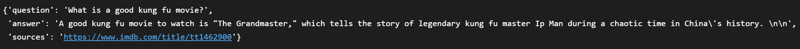

# **Hands-On Practice Gen AI 🤖: IMDb Chatbot based on RAG + OpenAi API + 🦆DuckDB**

---

By Jean-Yves Tran | jy.tran@[datascience-jy.com](https://datascience-jy.com) | [LinkedIn](https://www.linkedin.com/in/jytran-datascience/)  
IBM Certified Data Analyst 

---

---

Source: 
- [Kaggle IMDb Dataset](https://www.kaggle.com/datasets/ishikajohari/imdb-data-with-descriptions?resource=download) - IMDb Movies/Shows with Descriptions |  Ishika Johari
- [OpenAI API](https://openai.com/api) - OpenAI API Documentation
- [DuckDB for Python](https://duckdb.org/docs/installation/?version=stable&environment=python) - DuckDB DBMS
- [Retrieval Augmented Generation with the OpenAI API & DuckDB](https://www.packtpub.com/product/retrieval-augmented-generation-with-the-openai-api-duckdb/9781806025039?_gl=1*bsv5pl*_gcl_au*MTY1NjQ5NzM3NS4xNzM5NjI4ODI4LjE1MjY5MTc2MDUuMTc0NzE1MjI2MS4xNzQ3MTUyMjYx*FPAU*MTY1NjQ5NzM3NS4xNzM5NjI4ODI4) - Packt Platform | Vincent Vankrunkelsven
---
Question submitted to the app, with its answer:

This is a practice project aiming at the creation of a chatbot that can answer questions on movies using the following tech:  
- LLM: openAI 4o-mini
- vector embedding: 
  - cost: openAI "text-embedding-3-large" (openAI tiktoken module)
  - embedding: DuckDB (~50MB vector DB size)
- RAG: langchain + Kaggle IMDb dataset

Here are the main steps of the project:  
- The dataset was first cleaned and then left with a 4 selected columns
- Langchain documents were prepped for vectorizing (langchain document)
- the cost of the embedding was calculated (tokenizer): only 4.9 cents (0.049$)
- the vector database filling: total of 4963 documents (4 columns describing a movie)
- testing the vector DB with a question (similarity_search): 
  - What's a good movie about climate change?
  - and checking the answer given
- Prompt Engineering: expressing prompts for the RAG to use to answer the way we want it to
- Creating the RAG (retriever) and trying it with a question (RetrievalQAWithSourcesChain): 
  - what is a good climate change movie to watch?

**NOTES**:  
This app is for local use. This project does not include a deployment on the web or as an app in a marketplace or a binary. 

If you are using an interactive view of your Python file (for main.py), you will need to run this code snippet (modified with your own file path) for the OS to work on your preview:  
>import sys  
>import os

>sys.path.append("/home/jendives/MLpro/Data_ML_Practice_2025/9-0_Gen_AI/RAG_ChatGPT-API_DuckDB-Vector")

>from utils import count_embeddings